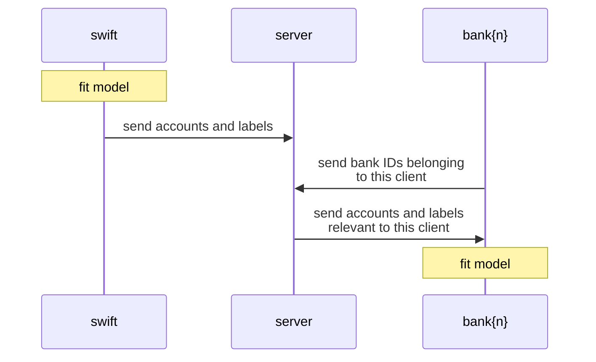
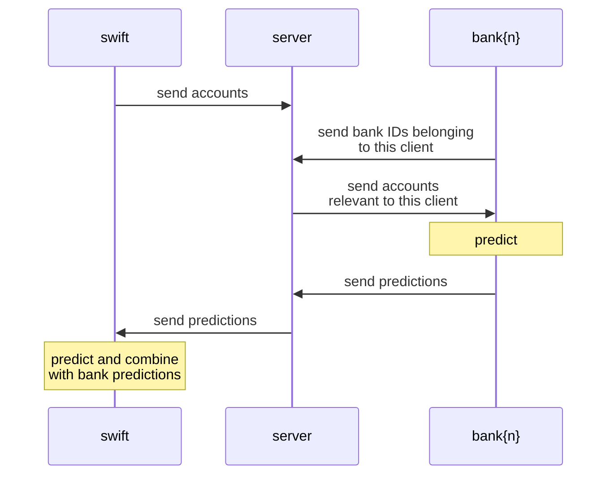

# Simple Example Model (Track A: Financial Crime Prevention)

This is an example solution that implements both federated and centralized versions of dummy models for Track A: Financial Crime Prevention.

The modeling approach makes use of a single categorical feature from the SWIFT transactions dataset (`InstructedCurrency`) and a single categorical feature from the bank accounts dataset (`Flag` corresponding to the `BeneficiaryAccount` in the transaction). Separate Naive Bayes models are trained on each feature, and the final prediction is the product. This example is _not_ intended to be a realistic solution, either from a modeling perspective or from a privacy perspective. It is simply intended to provide example code that works with the evaluation harness.

## Federated Version

In the federated version, each client maintains its own model. SWIFT communicates labeled data to the banks. For inference, the banks additionally send back predictions to SWIFT. See the sequence diagrams below.

This is intended to demonstrate use of the Flower API that may be directionally exemplary of more complex federation protocols. The example implements both training and test processes that involve more than one "round" in the Flower simulation. Additionally, the example also demonstrates some client-to-client communications of data that pass through the central server.

## Train process

## Test process

